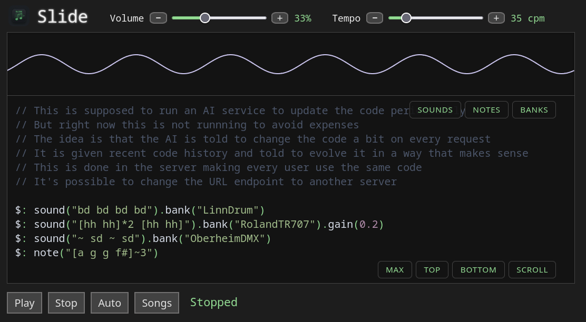
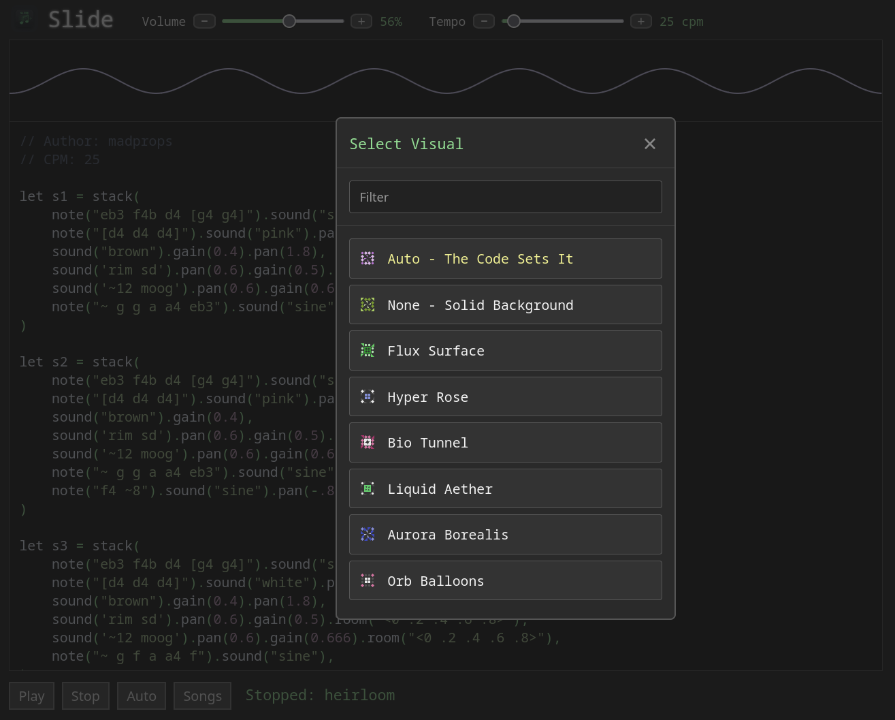

---

`Slide` is a web application that plays [`strudel`](https://strudel.cc/) music.

It has an editor to write code including autocomplete.

Patterns can evolve over time automatically through the use of `AI`.

It has a collection of songs ready to play.

There's a scope visualizer that supports gestures.

Multiple background visuals are available.

Current beats can be titled and shared through URLs.

---

Use `run.sh` to start the `flask` server.

The `root` shows the web interface.

There is a `/status` endpoint that is updated automatically.

The `status` is the latest beat/pattern.

At the top of `slide.py` there are some global variables to configure:

```python
MINUTES = 5
PORT = 4242
MAX_HISTORY = 3
USE_INSTRUCTIONS = False
ENABLE_AI_INTERVAL = False
```

---

PORT = The application port -> http://localhost:4242

---

### This for Auto mode

MINUTES = Is the interval delay for pattern regeneration.

MAX_HISTORY = The amount of saved pattern history, used for context when generating the new one.

ENABLE_AI_INTERVAL = Enable the periodic prompting to the AI to update the beat.

Auto mode allows the user to set their own endpoint.

The `PROMPT` variable holds the general prompt sent to the AI.

The history/beats are also included if they exist.

If `USE_INSTRUCTIONS` is true, the contents of `instructions.txt` is sent with the prompt, which is a general explanation of how `strudel` works.

---

# Credits

A big thank you to `Strudel` and `CodeMirror` for making the audio and text engines.

And to the AIs that assisted me on writing some of the code, especially `Gemini`.