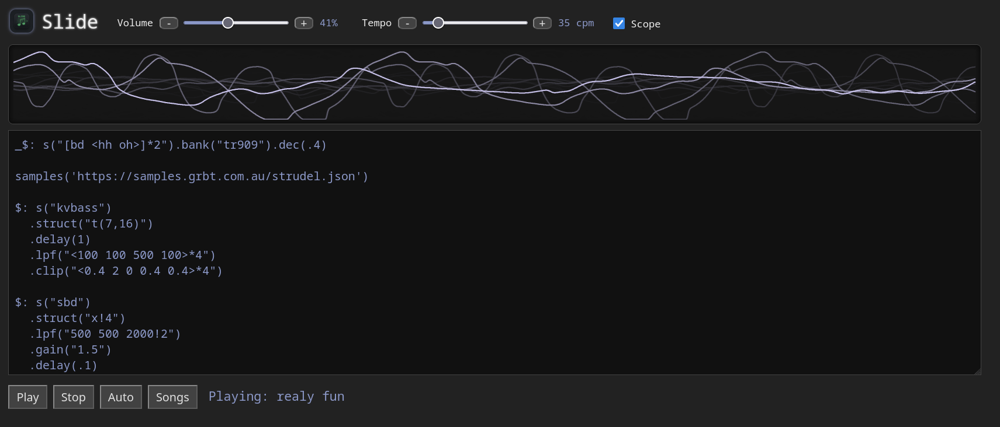
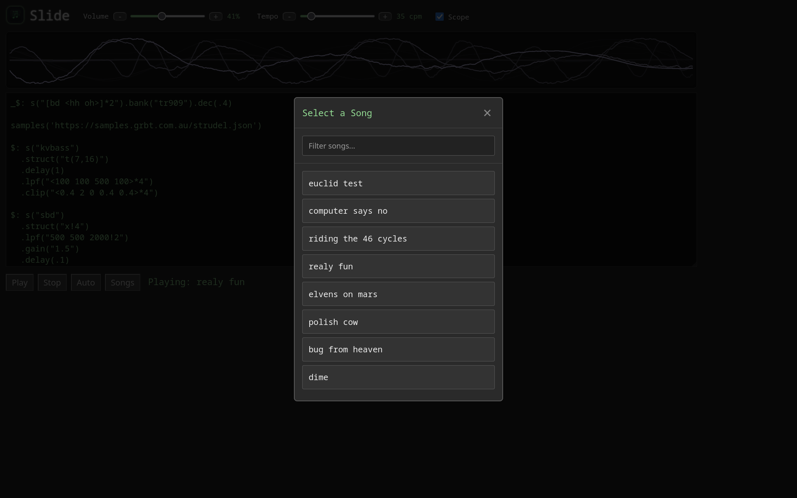
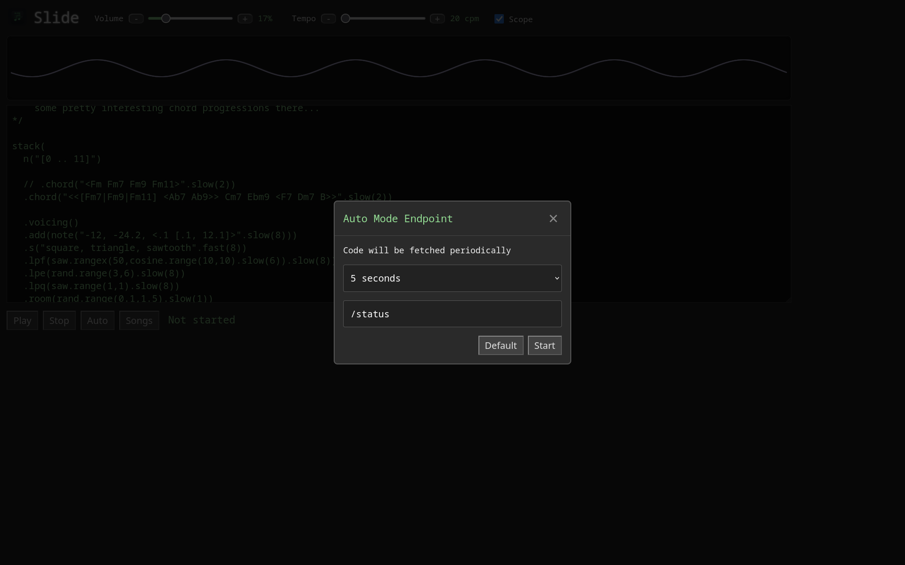
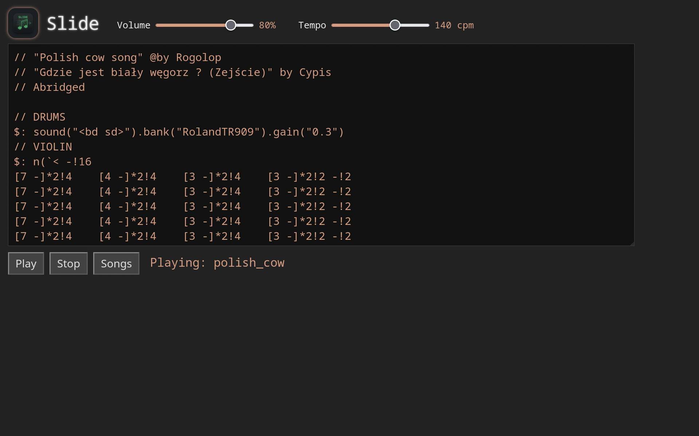

---

`Slide` is a web application that plays dynamic `strudel` music.

Patterns evolve over time automatically through the use of `AI`.

---

Use `run.sh` to start the `flask` server.

The `root` shows the web interface.

There is a `/status` endpoint that is updated automatically.

The `status` is the latest beat/pattern.

At the top of `slide.py` there are some global variables to configure:

```python
MINUTES = 5
PORT = 4242
MAX_HISTORY = 3
USE_INSTRUCTIONS = False
```

---

MINUTES = Is the interval delay for pattern regeneration.

PORT = The application port -> http://localhost:4242

MAX_HISTORY = The amount of saved pattern history, used for context when generating the new one.

---

The `PROMPT` variable holds the general prompt sent to the AI.

The history/beats are also included if they exist.

If `USE_INSTRUCTIONS` is true, the contents of `instructions.txt` is sent with the prompt, which is a general explanation of how `strudel` works.
